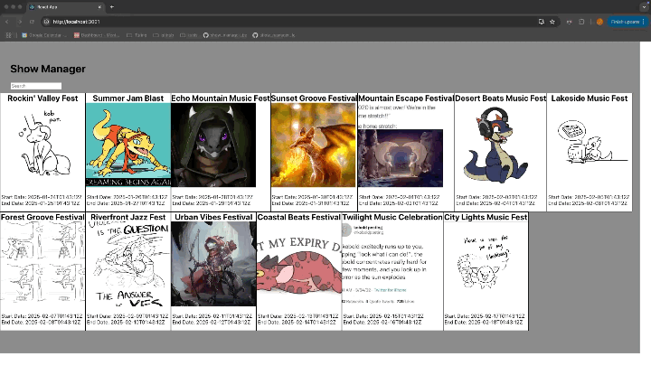

# Show Manager (Frontend)

Show Manager is a web application designed to help users manage music festivals, artists/bands, and attendees. This repository contains the frontend of the application, built using React and JSX.

## Table of Contents
- [Overview](#overview)
- [Technologies Used](#technologies-used)
- [Features](#features)
- [Setup and Installation](#setup-and-installation)
- [Usage](#usage)
- [Folder Structure](#folder-structure)
- [Future Enhancements](#future-enhancements)
- [Contact](#contact_details)

## Overview
The Show Manager frontend serves as the user interface for interacting with the application's backend API. Admin can view festival schedules, manage their artists/bands in said festivals, and explore festival details.



## Technologies Used
- **React**: JavaScript library for building user interfaces
- **React Router**: For handling client-side routing
- **CSS**: For styling components
- **JavaScript (ES6)**: For application logic

## Features
- **View All Festival Schedules**: Explore a list of all music festivals.
- **Remove Shows**: Remove specific shows from a festival's schedule.

## Setup and Installation

### Prerequisites
- Node.js (v16 or later recommended)
- npm 

### Steps
1. Clone the repository:
   ```bash
   git clone https://github.com/Crosswolfv1/show_manager_fe.git
   ```
2. Navigate to the project directory:
   ```bash
   cd show_manager_fe
   ```
3. Install dependencies:
   ```bash
   npm install
   ```
4. Start the development server:
   ```bash
   npm start
   ```
5. Open your browser and go to `http://localhost:3000` to view the application.

## Usage
- Navigate to the homepage to see an overview of available festivals.
- Select a festival by clicking on it to view artists/bands and users attending.
- Remove shows from the festival directly via the user interface.

## Folder Structure
```
show_manager_fe/
├── public/              # Public assets
├── src/
│   ├── components/      # Reusable React components
│   │   ├── homepage/    # Homepage-specific components
│   │   ├── festival/    # Festival-related components
│   ├── App.js           # Main application component
│   ├── index.js         # Entry point for the React app
├── package.json         # Project metadata and dependencies
```

## Future Enhancements
- Add user managment, creation, deletion modification.
- Better CSS, make more responsive follow ARIA guidelines for accessability
- Calendar intergrations instead of just statime time and dates

## Contact Details
- [Github](https://github.com/Crosswolfv1) Crosswolfv1
- [LinkedIn](https://www.linkedin.com/in/jeremiahross/) /in/jeremiahross